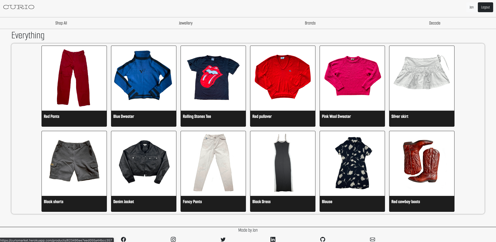

<h1>Curio</h1>

Curio is a peer to peer marketplace where users can display and sell their unique pre-loved clothing and accessories

<h2>Features include:</h2>

 <ul>
    <li>View products from all users</li>
    <li>Contact users by email</li>
    <li>Upload, edit, and delete posts</li>
 </ul>

Technologies Used

<ul>
<li>Express</li>
<li>JavaScript</li>
<li>MongoDB</li>
<li>HTML</li>
<li>CSS</li>
</ul>

<h2>Icebox</h2>

Future changes include:

<ul>
   <li>Better sorting for products</li>
   <li>Ability to message users directly in app</li>
   <li>Ability to upload multiple images per product</li>
   <li>Ability to edit photos for products</li>
</ul>

Check out [CURIO](https://curiomarket.herokuapp.com/)
